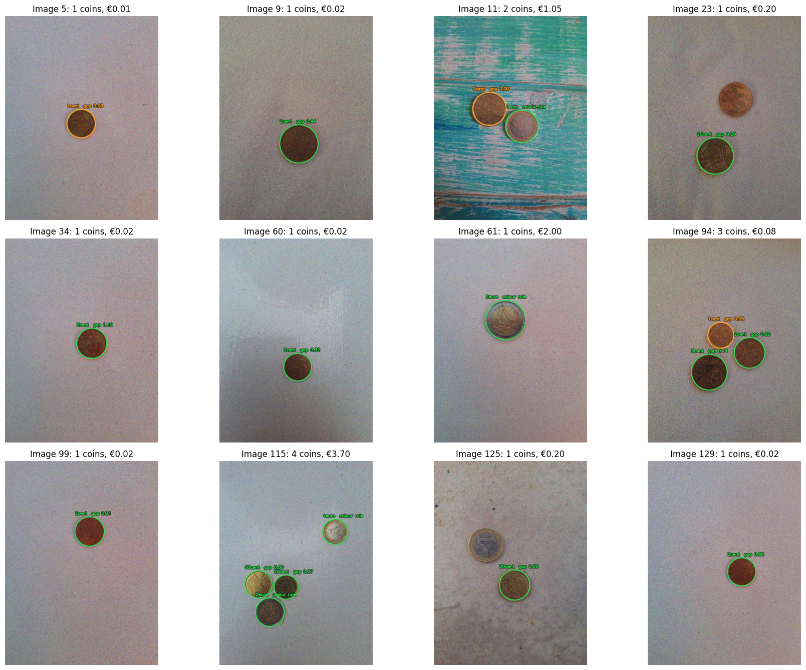

# Image Processing and Computer Vision Projects

Two projects developed for the **Image Processing and Computer Vision** course at the University of Bologna.

The projects explore two complementary approaches to computer vision: a traditional image-processing pipeline for coin recognition and a deep-learning approach for fine-grained aircraft classification.

## Authors

- Annalisa Poluzzi
- Jacopo Francesco Amoretti
- Alessia Andrea Toma

Both projects were developed collaboratively by the three team members.

---

## Module 1 — Coin Detection, Classification and Counting

The goal of this project is to detect euro coins in photographs, classify their denomination, and compute the total monetary value.

The solution is based entirely on traditional computer-vision and image-processing techniques, without neural networks.

### Approach

The pipeline combines:

- image preprocessing and noise reduction;
- circular Hough transform for coin detection;
- circular ROI extraction and masking;
- colour-based analysis;
- SIFT feature extraction and matching;
- RANSAC-based geometric verification;
- rotation-tolerant polar representations;
- relative coin-size information;
- fusion of multiple classification cues.

The method was designed to handle variations in illumination, scale, rotation, background texture, viewpoint, and partial occlusion.

### Notebook

The complete implementation and analysis are available in
[`assignment_module_one.ipynb`](assignment_module_one.ipynb).

### Example

---

## Module 2 — Fine-Grained Aircraft Classification

The second project addresses fine-grained aircraft classification on the FGVC-Aircraft dataset, which contains 100 aircraft variants.

The project compares a convolutional neural network designed and trained from scratch with transfer learning using a pretrained ResNet-18.

### Custom CNN

A custom convolutional architecture was developed using:

- convolutional blocks;
- batch normalization;
- ReLU activations;
- max pooling;
- dropout;
- data augmentation.

An ablation study was performed to evaluate the contribution of batch normalization, data augmentation, dropout, and network depth.

The custom CNN achieved approximately **50% test accuracy**.

### Transfer Learning with ResNet-18

A pretrained ResNet-18 was first evaluated with a frozen backbone and then fully fine-tuned for the aircraft classification task.

- **Frozen backbone:** 33.66% test accuracy
- **Fully fine-tuned ResNet-18:** 79.51% test accuracy
- **Peak test accuracy:** 80.02%

The experiments demonstrate the importance of adapting pretrained representations to the fine-grained aircraft domain rather than relying only on generic ImageNet features.

### Notebook

The complete implementation, ablation study, training procedure, and evaluation are available in
[`assignment_module_two.ipynb`](assignment_module_two.ipynb).

---

## Technologies

Python · OpenCV · NumPy · Matplotlib · Pandas · PyTorch · Torchvision · Scikit-learn